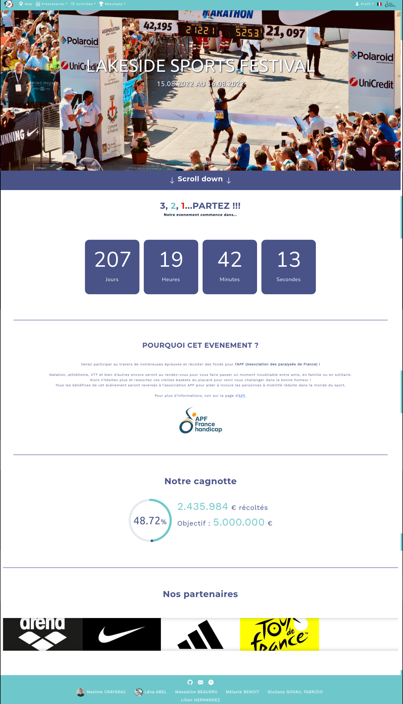
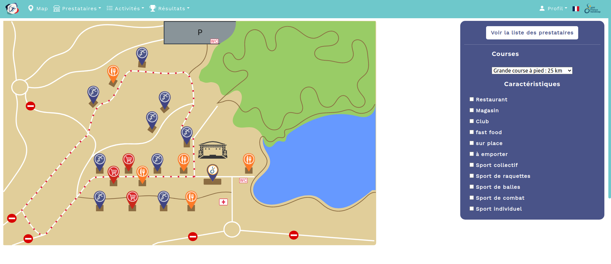
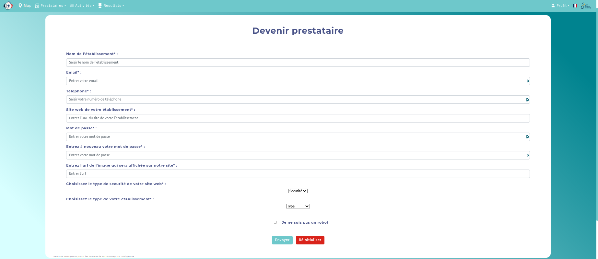
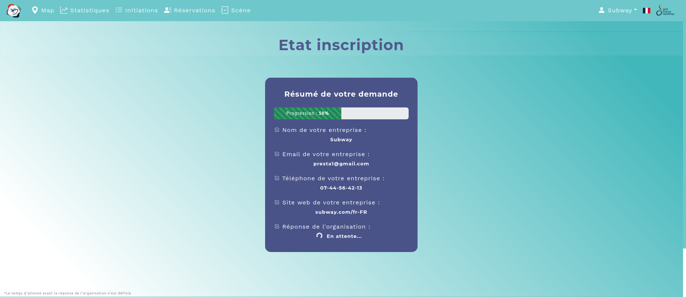

# LAKESIDE SPORTS FESTIVAL 🏊🏼‍♀️

## *AN REST-API USING NODEJS, POSTGRESQL, VUEJS* 
&nbsp;&nbsp;&nbsp;&nbsp;The goal of this project is to create an application with:
- 👩‍💻 A visual part written in **Javascript** with **VueJs**.
- 💻 A database implemented with **PostgreSQL**,
- 💾 A server written in NodeJs, which is the link between the browser and the database, as a **REST-API** and which is also used to send **Javascript** created in **VueJS** to the browser.


&nbsp;&nbsp;&nbsp;&nbsp;This organization allows the browser, through user interactions with the application's graphical interface, to send requests to the API server.
  
Depending on the type of request and its associated data (JSON objects), the API server will execute certain instructions to update the database, and/or extract informations from it to produce new data sent to the browser.

You can find more instructions [here](https://cours-info.iut-bm.univ-fcomte.fr/index.php/menu-cours-s3/sae-dev-appli-avec-bdd/2387-presentation-de-la-sae)
-----------------------------------------------------------------------------------------------------
## PROTOTYPES AND STORYBOARDS

### PUBLIC 

https://trello.com/b/mL03H8Zy/storyboard-utilisateur

### SERVICE PROVIDER
https://trello.com/b/cfiJzkql/storyboard-prestataire

### ORGANIZER 
https://trello.com/b/nnZTz9Kf/storyboard-organisateur

------------------------------------------------------------------------------------------------------

## INSTALLATION
### Setup
 Clone the repository.

**Install the dependencies**
```
npm install 
```

**Run NodeJS server** 
```
npm start 
```

**Run VueJS** 
```
npm run serve
```
Open the browser and go to http://localhost:8080

------------------------------------------------------------------------------------------------------
## OVERVIEW OF THE WEBSITE

The website starts and we arrive at http://localhost:8080. On this page, you can find a summary of the festival which is a collection of donations for the association APF France Handicap.



Going on http://localhost:8080/map, we can find an interactive map with restaurants, clubs, shops and the association we work with. Filters are available on the right. 



If a person wants to become a service provider, he may ask the organizer to become one.



*Waiting for the organizer to accept the request ...*



When the request is sent, the organizer can observe all the requests that has been sent to him.

 

Once the request is accepted, the service provider will now have an account.


