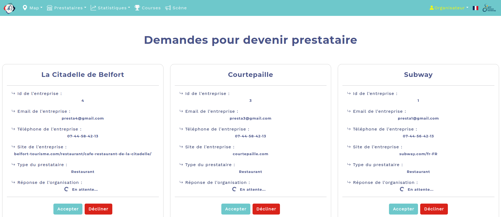

# LAKESIDE SPORTS FESTIVAL 🏊🏼‍♀️

## *AN REST-API USING NODEJS, POSTGRESQL, VUEJS* 
&nbsp;&nbsp;&nbsp;&nbsp;The goal of this project is to create an application with:
- 👩‍💻 A visual part written in **Javascript** with **VueJs**.
- 💻 A database implemented with **PostgreSQL**,
- 💾 A server written in NodeJs, which is the link between the browser and the database, as a **REST-API** and which is also used to send **Javascript** created in **VueJS** to the browser.


&nbsp;&nbsp;&nbsp;&nbsp;This organization allows the browser, through user interactions with the application's graphical interface, to send requests to the API server.
  
Depending on the type of request and its associated data (JSON objects), the API server will execute certain instructions to update the database, and/or extract informations from it to produce new data sent to the browser.

You can find more instructions [here](https://cours-info.iut-bm.univ-fcomte.fr/index.php/menu-cours-s3/sae-dev-appli-avec-bdd/2387-presentation-de-la-sae)
-----------------------------------------------------------------------------------------------------
## PROTOTYPES AND STORYBOARDS

### PUBLIC 

https://trello.com/b/mL03H8Zy/storyboard-utilisateur

### SERVICE PROVIDER
https://trello.com/b/cfiJzkql/storyboard-prestataire

### ORGANIZER 
https://trello.com/b/nnZTz9Kf/storyboard-organisateur

------------------------------------------------------------------------------------------------------

## INSTALLATION

Clone the repository.

Before launching the application you must make sure you have a **PostgreSQL** and **MongoDB** database.

### POSTGRESQL : 
1. Create a database named sae_s3

```create database sae_s3;```

2. Launch the database creation script located in SAE-S3/BDD/script.sql
```\i script.sql```

3. Open the file in BDD/data.sql, this file will feed the BDD. You will see lines similar to this :

	*\COPY AGE (libelle_age) FROM C:\Users\lena3\OneDrive\Documents\IUT_Windows\S3\SAE-S3\BDD\AGE.csv' DELIMITER AS ',';
select * from AGE;*


4. Select with CTRL+R the path and replace it with your path to the BDD file. Example: C:\Users\yourName\Downloads\SAE-S3\BDD
Return to your postgresql terminal, run the data.sql script:

```\i data.sql```

### MONGODB :
1. Open a terminal and head to SAE-S3/web_socket
2. Run the ``mongosh`` command
3. ``use sae_s3``
4. ```load("./database/insert/accounts.js")```

```load("./database/insert/messages.js")```

The last step is to modify the PostgreSQL db.js file to connect to the database. The file is located in *api/database/db.js*. Open this file and modify the username and password with your credentials.

Now that the databases are in place here is how to launch the application:

1. Open four terminals. Check that you are in the SAE-S3 directory.
In the first terminal, run the following commands:

```
cd api
npm install
npm start
```

2. Second terminal : 

```
cd auth_api
npm install
npm start
```
3. Third terminal :
```
cd vuejs
npm install
npm run serve
```

4. Fourth terminal:

```
cd web_socket
npm install
npm start
```

Open the browser and go to http://localhost:8080


------------------------------------------------------------------------------------------------------
## OVERVIEW OF THE WEBSITE

The website starts and we arrive at http://localhost:8080. On this page, you can find a summary of the festival which is a collection of donations for the association APF France Handicap.


Going on http://localhost:8080/map, we can find an interactive map with restaurants, clubs, shops and the association we work with. Filters are available on the right. 


If a person wants to become a service provider, he may ask the organizer to become one.


*Waiting for the organizer to accept the request ...*


When the request is sent, the organizer can observe all the requests that has been sent to him.

 

Once the request is accepted, the service provider will now have an account.


